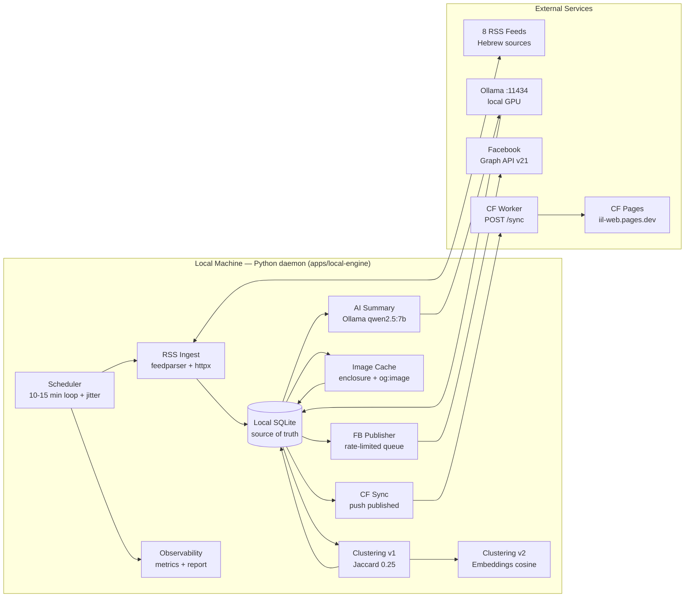

# docs/LOCAL_ENGINE_PLAN.md — Variant 3: Full Local Newsroom Engine

> **Статус:** В разработке — PATCH-01..09 (см. трекер ниже)
> **Цель:** Перенести всю обработку на локальную машину. Cloudflare — только витрина (read-only API + Pages).
> **Последнее обновление:** 2026-02-28

---

## 1. Контекст и мотивация

**Текущая система (Cloudflare):**
- RSS ingest → Jaccard clustering → AI summary (Gemini/Claude) → FB posting
- Работает 3 раза/день по cron
- Ограничение: 5 резюме + 5 FB постов за запуск (25-секундный бюджет Workers)
- Backlog: 245+ черновиков

**Проблема:** Архитектурный потолок — 15 публикаций/день. Нет изображений, нет хэштегов, FIFO без приоритетов.

**Решение (Variant 3):** Локальный Python-сервис как source of truth + D1 как витрина.

**Железо:**
| | |
|---|---|
| CPU | AMD Ryzen 7 PRO 3700 (8c/16t, 3.6 GHz) |
| RAM | 16 GB DDR4 2667 MHz |
| GPU | NVIDIA RTX 3070, 8 GB VRAM |
| OS | Windows 10 Pro |
| Ollama | v0.17.4, qwen2.5:7b-instruct Q4_K_M: **116 t/s**, 3с/резюме, 5.5 GB VRAM |

**Целевые метрики:** 50–200 публикаций/день, обновление каждые 10–15 минут, FB с изображениями + хэштеги.

---

## 2. Архитектура

### 2.1 Поток данных



### 2.2 Компонентная карта

```
apps/local-engine/
├── main.py                        # entry point + async scheduler loop
├── pyproject.toml                 # deps: aiosqlite, pydantic, structlog, httpx, feedparser...
├── .env.example                   # все переменные
├── config/
│   └── settings.py                # class Settings(BaseSettings) — все конфиг параметры
├── db/
│   ├── schema.py                  # все DDL (CREATE TABLE IF NOT EXISTS)
│   ├── migrate.py                 # apply_migrations(db) — идемпотентно при старте
│   ├── connection.py              # aiosqlite ctx mgr (WAL journal + FOREIGN KEYS ON)
│   └── repos/
│       ├── items_repo.py          # upsert_items() — INSERT OR IGNORE batch
│       ├── stories_repo.py        # find_recent_stories, create_story, update_story_summary
│       ├── story_items_repo.py    # attach_item()
│       ├── publications_repo.py   # get_stories_for_fb_posting, mark_fb_posted/failed
│       ├── runs_repo.py           # start_run, finish_run
│       ├── errors_repo.py         # record_error
│       ├── source_state_repo.py   # should_fetch (backoff), mark_success/failure
│       ├── images_repo.py         # get/set cached image
│       ├── publish_queue_repo.py  # enqueue, dequeue, update status
│       └── metrics_repo.py        # record metric, get_summary
├── sources/
│   ├── models.py                  # pydantic Source (id, url, type, throttle, category_hints)
│   └── registry.py               # load_sources(path) from ../../sources/registry.yaml
├── ingest/
│   ├── normalize.py               # normalize_url() ← IDENTICAL TO TS (item_key compat!)
│   ├── html_strip.py              # strip_html() — tags + entities
│   └── rss.py                     # fetch_rss(source, client) → list[NormalizedEntry]
│                                  # NormalizedEntry: item_key, title_he, enclosure_url, ...
├── cluster/
│   ├── tokens.py                  # tokenize(), jaccard_similarity(), HE_STOPWORDS (73)
│   ├── cluster.py                 # cluster_new_items() — 24h window, threshold > 0.25
│   ├── embeddings.py              # EmbeddingClient (Ollama /api/embeddings) + cosine_sim
│   └── cluster_v2.py             # hybrid: cosine 0.75 → Jaccard fallback
├── summary/
│   ├── ollama.py                  # OllamaClient.chat(system, user) → str
│   ├── prompt.py                  # build_system_prompt() — exact port from TS
│   ├── glossary.py                # apply_glossary(): ЦАХАЛ, ШАБАК, Кнессет, Тель-Авив...
│   ├── guards.py                  # guard_length, guard_forbidden_words, guard_numbers,
│   │                              # guard_high_risk — exact port from TS
│   ├── format.py                  # parse_sections() → 5 секций, format_body/full
│   ├── categories.py              # classify_category() + generate_hashtags() via Ollama
│   └── generate.py                # run_summary_pipeline() — memoization + всё вместе
├── images/
│   ├── cache.py                   # ImageCacheManager.ensure_cached() — etag + Pillow
│   └── og_parser.py              # extract_og_image(client, url) — BeautifulSoup
├── publish/
│   ├── facebook.py                # FacebookClient: post_text() + post_photo() multipart
│   └── queue.py                   # PublishQueueManager: rate limits + backoff + circuit breaker
├── sync/
│   └── cf_sync.py                 # CloudflareSync.push_stories() → POST /api/v1/sync/stories
├── observe/
│   ├── logger.py                  # configure_logging() — structlog JSON + file
│   ├── metrics.py                 # MetricsRecorder.record() / get_summary()
│   ├── report.py                  # generate_daily_report() → markdown
│   └── why_not.py                 # why_not_published(story_id) → list[str] (диагностика)
└── tests/
    ├── conftest.py                # in-memory SQLite, mock Sources, mock httpx
    ├── fixtures/
    │   ├── ynet_main.xml          # копия из apps/worker/test/fixtures/
    │   ├── atom_sample.xml
    │   ├── sample_og.html
    │   └── cluster_eval_pairs.json
    └── test_*.py                  # по файлу на каждый модуль
```

### 2.3 State Machines

**Publish Queue:**
```
[story published] → pending
pending → in_progress → completed ✓
                      → failed → pending (exp backoff: min(2^n×60s, 1h) + jitter)
                      → rate_limited → pending (after cooldown window)
failed (≥ max_attempts) → [dead — не переиздаётся]
```

**Source Scheduling:**
```
[startup] → ready
ready → fetching → cooldown (min_interval_sec ± 20% jitter) → ready
                 → backoff (exp: 30s → 60s → 120s → ... max 1h) → ready
```

---

## 3. База данных

### 3.1 D1-совместимые таблицы (идентичные копии)

7 таблиц из `db/migrations/001_init.sql` + `002_editorial_hold.sql` реплицируются без изменений:
`items`, `stories` (+ `editorial_hold`), `story_items`, `publications`, `runs`, `run_lock`, `error_events`.

Это гарантирует совместимость `item_key` при синке с D1.

### 3.2 Новые локальные таблицы

```sql
-- Состояние источника: когда последний раз fetched, backoff
CREATE TABLE IF NOT EXISTS source_state (
  source_id            TEXT PRIMARY KEY,
  last_fetch_at        TEXT,
  last_success_at      TEXT,
  consecutive_failures INTEGER NOT NULL DEFAULT 0,
  backoff_until        TEXT,              -- NULL = готов; иначе ISO8601
  total_fetches        INTEGER NOT NULL DEFAULT 0,
  total_items_found    INTEGER NOT NULL DEFAULT 0,
  updated_at           TEXT NOT NULL
);

-- Кэш изображений
CREATE TABLE IF NOT EXISTS images_cache (
  image_id     TEXT PRIMARY KEY,          -- sha256(original_url)
  item_id      TEXT,
  story_id     TEXT,
  original_url TEXT NOT NULL,
  local_path   TEXT,                      -- data/images/{2-char-prefix}/{sha256}.{ext}
  etag         TEXT,
  content_hash TEXT,                      -- sha256 байт файла
  width        INTEGER,
  height       INTEGER,
  size_bytes   INTEGER,
  mime_type    TEXT,
  cached_at    TEXT NOT NULL,
  status       TEXT NOT NULL DEFAULT 'pending'  -- pending|downloaded|failed|expired
);
CREATE INDEX IF NOT EXISTS idx_images_item   ON images_cache(item_id);
CREATE INDEX IF NOT EXISTS idx_images_story  ON images_cache(story_id);
CREATE INDEX IF NOT EXISTS idx_images_status ON images_cache(status);

-- Очередь публикаций (fb / telegram / cf_sync)
CREATE TABLE IF NOT EXISTS publish_queue (
  queue_id        TEXT PRIMARY KEY,
  story_id        TEXT NOT NULL REFERENCES stories(story_id) ON DELETE CASCADE,
  channel         TEXT NOT NULL,          -- fb | telegram | cf_sync
  status          TEXT NOT NULL DEFAULT 'pending',
  priority        INTEGER NOT NULL DEFAULT 0,
  scheduled_at    TEXT NOT NULL,
  started_at      TEXT,
  completed_at    TEXT,
  attempts        INTEGER NOT NULL DEFAULT 0,
  max_attempts    INTEGER NOT NULL DEFAULT 5,
  last_error      TEXT,
  fb_dedupe_key   TEXT,                   -- story_id:v{summary_version} — идемпотентность
  backoff_seconds INTEGER NOT NULL DEFAULT 0,
  created_at      TEXT NOT NULL
);
CREATE UNIQUE INDEX IF NOT EXISTS idx_pq_dedupe
  ON publish_queue(fb_dedupe_key) WHERE fb_dedupe_key IS NOT NULL;
CREATE INDEX IF NOT EXISTS idx_pq_status_sched  ON publish_queue(status, scheduled_at);
CREATE INDEX IF NOT EXISTS idx_pq_channel_status ON publish_queue(channel, status);

-- Singleton: квоты FB (posts_this_hour, posts_today)
CREATE TABLE IF NOT EXISTS fb_rate_state (
  id                INTEGER PRIMARY KEY CHECK (id = 1),
  posts_this_hour   INTEGER NOT NULL DEFAULT 0,
  hour_window_start TEXT,
  posts_today       INTEGER NOT NULL DEFAULT 0,
  day_window_start  TEXT,
  last_post_at      TEXT,
  updated_at        TEXT NOT NULL
);

-- Метрики
CREATE TABLE IF NOT EXISTS metrics (
  metric_id   INTEGER PRIMARY KEY AUTOINCREMENT,
  run_id      TEXT,
  phase       TEXT NOT NULL,             -- ingest|cluster|summary|images|fb|sync
  key         TEXT NOT NULL,             -- items_new, duration_ms, posted, ...
  value       REAL NOT NULL,
  recorded_at TEXT NOT NULL
);
CREATE INDEX IF NOT EXISTS idx_metrics_phase_key ON metrics(phase, key, recorded_at DESC);

-- Ежедневные отчёты
CREATE TABLE IF NOT EXISTS daily_reports (
  report_date       TEXT PRIMARY KEY,    -- YYYY-MM-DD
  report_markdown   TEXT NOT NULL,
  stories_published INTEGER NOT NULL DEFAULT 0,
  fb_posts          INTEGER NOT NULL DEFAULT 0,
  errors_total      INTEGER NOT NULL DEFAULT 0,
  generated_at      TEXT NOT NULL
);

-- Embeddings кэш (PATCH-09)
CREATE TABLE IF NOT EXISTS item_embeddings (
  item_key   TEXT PRIMARY KEY,
  embedding  BLOB NOT NULL,              -- float32 numpy array, serialized
  model      TEXT NOT NULL,
  dimensions INTEGER NOT NULL,
  created_at TEXT NOT NULL
);
```

---

## 4. Конфигурация (.env)

```bash
# База данных
DATABASE_PATH=data/news_hub.db

# Планировщик
SCHEDULER_INTERVAL_SEC=600       # 10 минут
SCHEDULER_JITTER_SEC=60          # ±60с случайный сдвиг

# Источники
SOURCES_REGISTRY_PATH=../../sources/registry.yaml

# Ollama
OLLAMA_BASE_URL=http://localhost:11434
OLLAMA_MODEL=qwen2.5:7b-instruct
OLLAMA_TIMEOUT_SEC=30
OLLAMA_MAX_RETRIES=2

# Суммаризация
SUMMARY_TARGET_MIN=400
SUMMARY_TARGET_MAX=700
MAX_SUMMARIES_PER_RUN=50         # лимит убран (нет бюджета CF)

# Facebook
FB_POSTING_ENABLED=false         # безопасный дефолт
FB_PAGE_ID=
FB_PAGE_ACCESS_TOKEN=            # секрет, не в репо
FB_MAX_PER_HOUR=8
FB_MAX_PER_DAY=40
FB_MIN_INTERVAL_SEC=180          # 3 минуты между постами

# Кэш изображений
IMAGE_CACHE_DIR=data/images
IMAGE_MAX_SIZE_MB=5
IMAGE_FETCH_TIMEOUT_SEC=15

# Cloudflare Sync
CF_SYNC_ENABLED=false
CF_SYNC_URL=https://iil.sindromradiospb.workers.dev/api/v1/sync/stories
CF_SYNC_TOKEN=                   # секрет

# Логирование
LOG_LEVEL=INFO
LOG_FORMAT=json                  # json | text
LOG_FILE=data/logs/engine.jsonl

# Окружение
SERVICE_ENV=dev
```

---

## 5. Patch Plan

| PATCH | Цель | Статус |
|-------|------|--------|
| [PATCH-01](#patch-01) | Bootstrap: DB schema + migrations + run system + logging | `[ ]` |
| [PATCH-02](#patch-02) | RSS ingest + URL нормализация + per-source rate limiting | `[ ]` |
| [PATCH-03](#patch-03) | Clustering MVP (Jaccard + Hebrew tokenizer) | `[ ]` |
| [PATCH-04](#patch-04) | AI summarizer (Ollama) + guards + glossary + auto-category | `[ ]` |
| [PATCH-05](#patch-05) | Image cache (enclosure/og:image + etag + Pillow) | `[ ]` |
| [PATCH-06](#patch-06) | FB publish queue + rate limits + image upload + idempotency | `[ ]` |
| [PATCH-07](#patch-07) | CF Worker sync endpoint + local push + Pages polling | `[ ]` |
| [PATCH-08](#patch-08) | Observability + daily report + runbook + security docs | `[ ]` |
| [PATCH-09](#patch-09) | Clustering v2 (embeddings) + eval harness | `[ ]` |

---

### PATCH-01

**Scope:** Bootstrap Python project. DB layer. Structured logging. Run tracking.

**Зависимости (pip):** `aiosqlite>=0.20`, `pydantic>=2.6`, `pydantic-settings>=2.2`, `structlog>=24.1`

**Файлы:**
```
apps/local-engine/
  pyproject.toml          # [project], [tool.pytest], [tool.ruff]
  .env.example
  main.py                 # minimal: init DB, run once, exit
  config/__init__.py
  config/settings.py      # class Settings(BaseSettings)
  db/__init__.py
  db/schema.py            # ALL_TABLES: list[str] — CREATE TABLE IF NOT EXISTS ...
  db/migrate.py           # async def apply_migrations(db)
  db/connection.py        # @asynccontextmanager get_db(path) → aiosqlite.Connection
  db/repos/__init__.py
  db/repos/runs_repo.py   # start_run, finish_run, get_recent_runs
  db/repos/errors_repo.py # record_error, get_errors_for_run
  observe/__init__.py
  observe/logger.py       # configure_logging(level, fmt, log_file)
  tests/__init__.py
  tests/conftest.py       # async_db fixture (in-memory)
  tests/test_settings.py
  tests/test_migrate.py
  tests/test_runs_repo.py
  tests/test_errors_repo.py
  tests/test_logger.py
```

**Команды тестирования:**
```bash
cd apps/local-engine
python -m pytest tests/test_settings.py tests/test_migrate.py tests/test_runs_repo.py -v
```

**Commit:** `feat(local-engine): PATCH-01 scaffold — DB schema, migrations, run system, logging`

---

### PATCH-02

**Scope:** RSS pipeline из TS в Python. Per-source scheduling с backoff.

**Зависимости (pip):** `httpx>=0.27`, `feedparser>=6.0`, `pyyaml>=6.0`

**Файлы:**
```
sources/models.py          # pydantic Source (id, url, type, throttle, category_hints, enabled)
sources/registry.py        # load_sources(path), get_enabled_sources()
ingest/__init__.py
ingest/normalize.py        # normalize_url(), validate_url_for_fetch(), hash_hex()
ingest/html_strip.py       # strip_html()
ingest/rss.py              # NormalizedEntry dataclass + fetch_rss(source, client, max_items)
db/repos/items_repo.py     # UpsertResult + upsert_items(db, entries, source_id)
db/repos/source_state_repo.py  # should_fetch(), mark_success(), mark_failure()
tests/fixtures/ynet_main.xml   # копия из apps/worker/test/fixtures/
tests/fixtures/atom_sample.xml
tests/test_normalize.py    # 21 кейс из TS + SSRF guard
tests/test_rss.py
tests/test_registry.py
tests/test_source_state.py
```

**Критично:** `normalize_url()` должен давать идентичный результат с `apps/worker/src/normalize/url.ts` — потому что `item_key = sha256(normalized_url)` используется при синке с D1.

**Commit:** `feat(local-engine): PATCH-02 RSS ingest — feedparser, URL normalization, per-source rate limiting`

---

### PATCH-03

**Scope:** Точный порт кластеризации из TS.

**Файлы:**
```
cluster/__init__.py
cluster/tokens.py        # tokenize(), jaccard_similarity(), HE_STOPWORDS (73 слова)
cluster/cluster.py       # ClusterCounters + cluster_new_items(db, items)
db/repos/stories_repo.py # find_recent_stories, create_story, update_story_last_update,
                         # get_stories_needing_summary, get_story_items_for_summary,
                         # update_story_summary
db/repos/story_items_repo.py  # attach_item()
tests/test_tokens.py     # порт из title_tokens.test.ts
tests/test_cluster.py    # порт из cluster.test.ts
```

**Критично:** regex `[^\u05D0-\u05EAa-zA-Z0-9]+`, threshold `> 0.25` (строго больше), окно 24h. Stopwords — точно 73 слова из TS.

**Commit:** `feat(local-engine): PATCH-03 clustering — Jaccard similarity, Hebrew tokenizer, 24h window`

---

### PATCH-04

**Scope:** Резюме через Ollama. Glossary, guards, auto-category, hashtags.

**Файлы:**
```
summary/__init__.py
summary/ollama.py        # class OllamaClient: chat(system, user) → str, is_available()
summary/prompt.py        # build_system_prompt(risk_level), build_user_message(items)
summary/glossary.py      # apply_glossary(text): ЦАХАЛ, ШАБАК, Кнессет, Тель-Авив...
summary/guards.py        # guard_length, guard_forbidden_words, guard_numbers, guard_high_risk
summary/format.py        # parse_sections(), format_body(), format_full()
summary/categories.py    # classify_category(title_ru, summary_ru) → str
                         # generate_hashtags(title_ru, category) → list[str]
summary/generate.py      # run_summary_pipeline(db, settings, run_id, ollama) → SummaryCounters
                         # Memoization: sha256(sorted(item_ids).join(',') + ':' + risk_level)
                         # MAX_SUMMARIES_PER_RUN=50 (нет ограничения CF)
tests/test_glossary.py   # порт из TS
tests/test_guards.py     # порт из TS
tests/test_format.py     # порт из TS
tests/test_ollama.py     # mock httpx
tests/test_summary.py    # pipeline с mocked Ollama
```

**Системный промпт:** точная копия из `apps/worker/src/summary/prompt.ts`.

**Commit:** `feat(local-engine): PATCH-04 AI summarizer — Ollama, guards, glossary, auto-category, hashtags`

---

### PATCH-05

**Scope:** Скачивание и кэширование изображений.

**Зависимости (pip):** `Pillow>=10.0`, `beautifulsoup4>=4.12`

**Файлы:**
```
images/__init__.py
images/cache.py     # class ImageCacheManager:
                    #   ensure_cached(db, url, item_id, story_id) → CachedImage | None
                    #   _download(url, etag?) → (bytes, new_etag?)
                    #   _validate_and_store(data, image_id) → CachedImage
                    #   Validates: JPEG/PNG/WebP, ≤ IMAGE_MAX_SIZE_MB
images/og_parser.py # extract_og_image(client, article_url, timeout) → str | None
db/repos/images_repo.py
tests/fixtures/sample_og.html
tests/test_image_cache.py  # download, etag 304, oversized rejection, corrupt, idempotent
tests/test_og_parser.py
```

**Flow:** RSS `enclosure_url` → fallback: GET article HTML → `<meta property="og:image">` → `If-None-Match: {etag}` → Pillow validate → `data/images/{2ch_prefix}/{sha256}.{ext}`

**Commit:** `feat(local-engine): PATCH-05 image cache — enclosure/og:image, etag, Pillow validation`

---

### PATCH-06

**Scope:** Rate-limited FB posting с загрузкой изображений.

**Файлы:**
```
publish/__init__.py
publish/facebook.py   # class FacebookClient:
                      #   post_text(message, link) → post_id
                      #   post_photo(message, image_bytes, mime_type) → post_id
                      #     multipart POST /{page-id}/photos (не url=!)
                      #   resolve_error_status(fb_code) → 'auth_error'|'rate_limited'|'failed'
publish/queue.py      # class PublishQueueManager:
                      #   enqueue(story_id, channel='fb') → queue_id
                      #   process_pending() → QueueCounters
                      #   _check_rate_limits() → bool  (8/hr, 40/day, 3min gap)
                      #   _process_one(entry)
                      #   _schedule_retry(entry, error)
                      #   Auth-error circuit breaker: 190/102 → stop all fb entries
                      #   Idempotency: fb_dedupe_key = story_id:v{summary_version}
db/repos/publish_queue_repo.py
tests/test_fb_publish.py
tests/test_queue.py
```

**Commit:** `feat(local-engine): PATCH-06 FB publish queue — rate limits, image upload, retries, idempotency`

---

### PATCH-07

**Scope:** Sync endpoint на Worker + push из локального движка + polling в Pages.

**Python файлы:**
```
sync/__init__.py
sync/cf_sync.py    # class CloudflareSync:
                   #   push_stories(db, limit=50) → SyncCounters
                   #   _serialize_story(story, items) → dict
                   # Tracks cf_synced_at per story
```

**TypeScript (Worker) файлы:**
```
apps/worker/src/api/sync.ts    # handleSync(request, env): POST /api/v1/sync/stories
                               # Auth: Authorization: Bearer <CF_SYNC_TOKEN>
                               # Body: { stories: [{story_id, title_ru, summary_ru, ...}] }
                               # D1 batch: INSERT OR REPLACE stories + INSERT OR IGNORE items
apps/worker/src/router.ts      # + POST /api/v1/sync/stories → handleSync
apps/worker/src/index.ts       # + CF_SYNC_TOKEN в Env interface
```

**Web файлы:**
```
apps/web/src/pages/index.astro  # + client-side polling каждые 60с
                                # (простой setInterval + fetch /api/v1/feed?cursor=top)
```

**DB:** добавить `cf_synced_at TEXT` в `stories` (LOCAL engine only).

**Commit:** `feat: PATCH-07 CF sync endpoint + local push + Pages polling`

---

### PATCH-08

**Scope:** Наблюдаемость и операционные документы.

**Файлы:**
```
observe/metrics.py   # class MetricsRecorder: record(run_id, phase, key, value)
                     #                         get_summary(hours=24) → dict
observe/report.py    # generate_daily_report(db, date) → markdown
                     # Секции: статистика / здоровье источников / топ историй / ошибки / FB
observe/why_not.py   # why_not_published(db, story_id) → list[str]
                     # Проверяет: state, editorial_hold, summary_ru, guard failures,
                     #            queue status, cf_sync_enabled
tests/test_metrics.py
tests/test_report.py
```

**Метрики за run:**
- `ingest.*`: sources_ok, sources_failed, items_found, items_new, duration_ms
- `cluster.*`: stories_new, stories_updated, duration_ms
- `summary.*`: attempted, published, failed, duration_ms, avg_tokens
- `images.*`: downloaded, cache_hit, failed
- `fb.*`: posted, failed, rate_limited
- `sync.*`: pushed, failed

**Документы:** `docs/ARCH_FULL_LOCAL.md` (mermaid), `docs/DB_SCHEMA_LOCAL.md`, `docs/OPS_RUNBOOK_FULL_LOCAL.md`, `docs/CLUSTERING_V2.md`, `docs/FB_PUBLISHING_POLICY.md`, `docs/SECURITY_NOTES_LOCAL.md`

**Commit:** `feat(local-engine): PATCH-08 observability — metrics, daily reports, diagnostics, runbooks`

---

### PATCH-09

**Scope:** Улучшенная кластеризация на embeddings. Eval harness для сравнения с Jaccard.

**Зависимости (pip):** `numpy>=1.26`

**Файлы:**
```
cluster/embeddings.py   # class EmbeddingClient:
                        #   embed(text) → np.ndarray  (via Ollama /api/embeddings)
                        #   embed_batch(texts) → list[np.ndarray]
                        # cosine_similarity(a, b) → float
cluster/cluster_v2.py  # cluster_new_items_v2(db, items, embedding_client, threshold=0.75)
                        # Если embedding недоступен → fallback на Jaccard
cluster/eval.py         # EvalResult(precision, recall, f1, ...)
                        # evaluate_clustering(pairs_file, embedding_client) → EvalResult
tests/fixtures/cluster_eval_pairs.json  # labeled pairs: [{a, b, should_match: bool}]
tests/test_embeddings.py
tests/test_cluster_v2.py
```

**DB:** таблица `item_embeddings` (уже в схеме из PATCH-01).

**Commit:** `feat(local-engine): PATCH-09 clustering v2 — embeddings, cosine similarity, eval harness`

---

## 6. Главный цикл (main.py)

```python
async def run_cycle(ctx: RunContext) -> None:
    run_id = uuid4().hex
    log = logger.bind(run_id=run_id)
    await start_run(ctx.db, run_id)
    started_at_ms = int(time.time() * 1000)
    counters = RunCounters()

    try:
        # Phase 1: RSS ingest (per-source scheduling)
        sources = get_enabled_sources(ctx.sources)
        for source in sources:
            if not await should_fetch(ctx.db, source.id, source.throttle.min_interval_sec):
                continue
            try:
                entries = await fetch_rss(source, ctx.http, source.throttle.max_items_per_run)
                result = await upsert_items(ctx.db, entries, source.id)
                counters.items_found += result.found
                counters.items_new += result.inserted
                if result.new_keys:
                    new_entries = [e for e in entries if e.item_key in result.new_keys]
                    cr = await cluster_new_items(ctx.db, new_entries)
                    counters.stories_new += cr.stories_new
                    counters.stories_updated += cr.stories_updated
                await mark_success(ctx.db, source.id, result.found)
                counters.sources_ok += 1
            except Exception as exc:
                await mark_failure(ctx.db, source.id)
                await record_error(ctx.db, run_id, "ingest", source.id, None, str(exc))
                counters.sources_failed += 1

        # Phase 2: AI summaries (без лимита — локальная Ollama)
        sr = await run_summary_pipeline(ctx.db, ctx.settings, run_id, ctx.ollama)
        counters.published_web += sr.published

        # Phase 3: Image caching
        await cache_story_images(ctx.db, ctx.image_mgr)

        # Phase 4: FB publish queue
        if ctx.settings.fb_posting_enabled:
            qr = await ctx.queue_mgr.process_pending()
            counters.published_fb += qr.posted

        # Phase 5: CF sync
        if ctx.settings.cf_sync_enabled:
            await ctx.cf_sync.push_stories(ctx.db)

    except Exception as exc:
        log.error("cycle_fatal", error=str(exc))
        counters.errors_total += 1

    finally:
        await finish_run(ctx.db, run_id, started_at_ms, counters)


async def main() -> None:
    settings = Settings()
    configure_logging(settings.log_level, settings.log_format, settings.log_file)
    sources = load_sources(settings.sources_registry_path)

    async with (
        get_db(settings.database_path) as db,
        httpx.AsyncClient(timeout=15) as http,
    ):
        await apply_migrations(db)
        ollama = OllamaClient(settings.ollama_base_url, settings.ollama_model)
        image_mgr = ImageCacheManager(settings.image_cache_dir, settings.image_max_size_mb, http)
        fb_client = FacebookClient(settings.fb_page_id, settings.fb_page_access_token, http)
        queue_mgr = PublishQueueManager(db, settings, fb_client, image_mgr)
        cf_sync = CloudflareSync(settings.cf_sync_url, settings.cf_sync_token, http)

        ctx = RunContext(db, settings, sources, http, ollama, image_mgr, queue_mgr, cf_sync)
        while True:
            await run_cycle(ctx)
            jitter = random.uniform(-settings.scheduler_jitter_sec, settings.scheduler_jitter_sec)
            await asyncio.sleep(settings.scheduler_interval_sec + jitter)
```

---

## 7. Тесты

### Стек
- **pytest** + **pytest-asyncio** — async тесты
- **respx** — mock для httpx (RSS, Ollama, FB API, CF sync)
- **In-memory SQLite** (`:memory:`) — все DB тесты через conftest fixture
- **pytest-cov** — coverage (target 85%+)

### Матрица тестов

| Уровень | ~Тестов | Что |
|---------|---------|-----|
| Unit | ~80 | Pure functions: normalize, tokenize, glossary, guards, format |
| Integration | ~40 | DB repos + pipeline с mock HTTP |
| E2E | ~5 | Полный цикл: ingest → cluster → summary → queue (все HTTP mocked) |

---

## 8. Финальный DoD (Variant 3)

- [ ] `python main.py` запускается → items, stories, summaries в SQLite
- [ ] `item_key` совпадает между Python и TS для одних URL
- [ ] Кластеризация даёт сопоставимые группировки на test fixtures
- [ ] Резюме проходят все guards (длина, запрещённые слова, числа, high-risk)
- [ ] FB постинг соблюдает квоты (8/час, 40/день, 3 мин между постами)
- [ ] FB посты включают изображения (multipart upload)
- [ ] CF sync пушит истории → видны на Pages сайте
- [ ] Pages лента обновляется через polling (60с)
- [ ] Ежедневный отчёт генерируется в валидный markdown
- [ ] Нет секретов в логах или в репозитории
- [ ] JSON логи пишутся в `data/logs/engine.jsonl`
- [ ] Graceful shutdown по Ctrl+C / SIGTERM
- [ ] `pytest tests/ -v` — все зелёные
- [ ] `pnpm -C apps/worker test` — все зелёные (регрессии нет)
- [ ] Все 6 доков присутствуют: ARCH/DB_SCHEMA/RUNBOOK/CLUSTERING/FB_POLICY/SECURITY

---

## 9. Критические файлы для реализации

| Файл | Зачем |
|------|-------|
| `apps/worker/src/normalize/url.ts` | URL normalization — ТОЧНЫЙ PORT для совместимости item_key |
| `apps/worker/src/normalize/title_tokens.ts` | Hebrew tokenizer + 73 stopwords + Jaccard |
| `apps/worker/src/summary/prompt.ts` | Системный промпт — переиспользовать дословно |
| `apps/worker/src/summary/glossary.ts` | Правила глоссария — портировать regex |
| `apps/worker/src/summary/guards.ts` | Guard-функции — портировать логику |
| `apps/worker/src/summary/format.ts` | 5-секционный парсер |
| `apps/worker/src/summary/pipeline.ts` | Мемоизация + flow pipeline |
| `apps/worker/src/cron/ingest.ts` | Фазы + error isolation pattern |
| `apps/worker/src/fb/post.ts` | FB Graph API + коды ошибок |
| `db/migrations/001_init.sql` | D1 schema DDL — реплицировать точно |
| `db/migrations/002_editorial_hold.sql` | editorial_hold column |

---

*Этот документ является living doc — статус патчей обновляется по мере реализации.*
